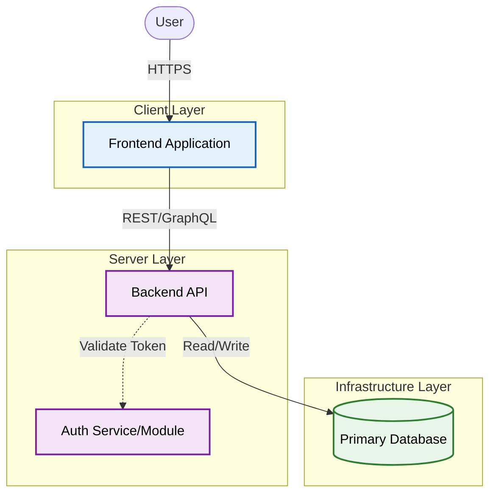

# Test-Project-Deployment-Check

    

## 📋 Table of Contents

- [Executive Summary](#executive-summary)
- [Key Features](#key-features)
- [System Architecture](#system-architecture)
- [Tech Stack](#tech-stack)
- [Installation & Setup](#installation)
- [API Reference](#api-reference)
- [Repository Structure](#repository-structure)

---

## <a name="executive-summary"></a>Executive Summary

This project, a cloud-native microservice-based system, leverages a technological stack comprising Docker, Express, GitHub Actions, JavaScript, MongoDB/Mongoose, Node.js, and React to deliver a robust set of core capabilities. At its core, the system provides modules for activity tracking, administration, authentication, commenting, dashboarding, labeling, project management, task management, and user management, thereby offering a comprehensive platform for collaborative project planning and execution. Recent updates have introduced significant security enhancements, database schema changes, and API endpoint updates, which have broadly impacted the system's authentication, database, and frontend components, notably including an updated AdminPage. These changes, classified as major with 114 files modified, underscore the system's evolving architecture and commitment to security and scalability, ultimately enhancing the overall value proposition for users and administrators alike.

---

## <a name="key-features"></a>Key Features

Based on the analyzed codebase, the system implements the following core capabilities:

- Authentication and authorization
- Project management
- Task management
- User management
- Comments and collaboration
- Labels and categorization
- Activity tracking/audit trail

---

## <a name="system-architecture"></a>System Architecture

The following diagram illustrates the high-level system components and their interactions:



For more details, see the [Full Architecture Documentation](architecture/architecture.md).

---

## <a name="tech-stack"></a>Tech Stack

**Detailed Analysis**:
- Docker
- Express
- GitHub Actions
- JavaScript
- MongoDB/Mongoose
- Node.js
- React

### Technologies Detected
    

### Languages
- **Javascript**: 84 file(s)
- **Other/Unknown**: 30 file(s)

---

## <a name="repository-structure"></a>Repository Structure

### Recent Changes Tree
```text
```
├── backend/
├── docs/
├── frontend/
├── .github/
```
```

<details>
<summary>📂 Click to view full list of changed files</summary>

1. `Dockerfile`
2. `README.md`
3. `docker-compose.yml`
4. `package.json`
5. `backend/.env.example`
6. `backend/.eslintrc.js`
7. `backend/package.json`
8. `docs/ADR-001.md`
9. `docs/api-reference.md`
10. `docs/architecture.md`
11. `docs/changelog.md`
12. `docs/data-model.md`
13. `docs/security.md`
14. `docs/testing.md`
15. `frontend/Dockerfile.dev`
16. `frontend/index.html`
17. `frontend/package.json`
18. `frontend/vite.config.js`
19. `.github/workflows/ci.yml`
20. `backend/src/app.js`
21. `backend/src/server.js`
22. `backend/tests/setup.js`
23. `frontend/src/App.jsx`
24. `frontend/src/index.css`
25. `frontend/src/main.jsx`
26. `frontend/tests/setup.js`
27. `backend/src/config/database.js`
28. `backend/src/config/index.js`
29. `backend/src/docs/swagger.js`
30. `backend/src/middleware/auth.js`
31. `backend/src/middleware/errorHandler.js`
32. `backend/src/middleware/index.js`
33. `backend/src/middleware/rbac.js`
34. `backend/src/middleware/requestLogger.js`
35. `backend/src/middleware/validate.js`
36. `backend/src/routes/index.js`
37. `backend/src/scripts/seed.js`
38. `backend/src/utils/ApiError.js`
39. `backend/src/utils/ApiResponse.js`
40. `backend/src/utils/asyncHandler.js`
41. `backend/src/utils/index.js`
42. `backend/src/utils/jwt.js`
43. `backend/src/utils/logger.js`
44. `backend/tests/integration/auth.test.js`
45. `backend/tests/integration/projects.test.js`
46. `backend/tests/integration/tasks.test.js`
47. `frontend/src/context/AuthContext.jsx`
48. `frontend/src/pages/AdminPage.css`
49. `frontend/src/pages/AdminPage.jsx`
50. `frontend/src/pages/AuthPages.css`
51. `frontend/src/pages/DashboardPage.css`
52. `frontend/src/pages/DashboardPage.jsx`
53. `frontend/src/pages/LoginPage.jsx`
54. `frontend/src/pages/ProfilePage.css`
55. `frontend/src/pages/ProfilePage.jsx`
56. `frontend/src/pages/ProjectDetailPage.css`
57. `frontend/src/pages/ProjectDetailPage.jsx`
58. `frontend/src/pages/ProjectsPage.css`
59. `frontend/src/pages/ProjectsPage.jsx`
60. `frontend/src/pages/RegisterPage.jsx`
61. `frontend/src/pages/TasksPage.css`
62. `frontend/src/pages/TasksPage.jsx`
63. `frontend/src/services/api.js`
64. `frontend/src/services/authService.js`
65. `frontend/src/services/projectService.js`
66. `frontend/src/services/taskService.js`
67. `frontend/src/services/userService.js`
68. `backend/src/modules/activity/Activity.model.js`
69. `backend/src/modules/comments/Comment.model.js`
70. `backend/src/modules/labels/Label.model.js`
71. `backend/src/modules/projects/Project.model.js`
72. `backend/src/modules/tasks/Task.model.js`
73. `backend/src/modules/users/User.model.js`
74. `frontend/src/components/auth/ProtectedRoute.jsx`
75. `frontend/src/components/common/Avatar.css`
76. `frontend/src/components/common/Avatar.jsx`
77. `frontend/src/components/common/Layout.css`
78. `frontend/src/components/common/Layout.jsx`
79. `frontend/src/components/common/LoadingSpinner.css`
80. `frontend/src/components/common/LoadingSpinner.jsx`
81. `frontend/src/components/common/Navbar.css`
82. `frontend/src/components/common/Navbar.jsx`
83. `frontend/src/components/common/Sidebar.css`
84. `frontend/src/components/common/Sidebar.jsx`
85. `backend/src/modules/activity/controllers/activity.controller.js`
86. `backend/src/modules/activity/routes/activity.routes.js`
87. `backend/src/modules/activity/services/activity.service.js`
88. `backend/src/modules/auth/controllers/auth.controller.js`
89. `backend/src/modules/auth/routes/auth.routes.js`
90. `backend/src/modules/auth/services/auth.service.js`
91. `backend/src/modules/auth/validators/auth.validator.js`
92. `backend/src/modules/comments/controllers/comment.controller.js`
93. `backend/src/modules/comments/routes/comment.routes.js`
94. `backend/src/modules/comments/services/comment.service.js`
95. `backend/src/modules/comments/validators/comment.validator.js`
96. `backend/src/modules/labels/controllers/label.controller.js`
97. `backend/src/modules/labels/routes/label.routes.js`
98. `backend/src/modules/labels/services/label.service.js`
99. `backend/src/modules/labels/validators/label.validator.js`
100. `backend/src/modules/projects/controllers/project.controller.js`
101. `backend/src/modules/projects/repositories/project.repository.js`
102. `backend/src/modules/projects/routes/project.routes.js`
103. `backend/src/modules/projects/services/project.service.js`
104. `backend/src/modules/projects/validators/project.validator.js`
105. `backend/src/modules/tasks/controllers/task.controller.js`
106. `backend/src/modules/tasks/repositories/task.repository.js`
107. `backend/src/modules/tasks/routes/task.routes.js`
108. `backend/src/modules/tasks/services/task.service.js`
109. `backend/src/modules/tasks/validators/task.validator.js`
110. `backend/src/modules/users/controllers/user.controller.js`
111. `backend/src/modules/users/repositories/user.repository.js`
112. `backend/src/modules/users/routes/user.routes.js`
113. `backend/src/modules/users/services/user.service.js`
114. `backend/src/modules/users/validators/user.validator.js`

</details>

---

## <a name="installation"></a>Installation & Setup

### Prerequisites

Ensure you have the following installed:
- Docker, Java

### Quick Start

```bash
# Clone the repository
git clone ...

# Install dependencies
npm install  # or pip install -r requirements.txt

# Run development server
npm run dev
```

### Configuration
- Environment-variable configuration is present (`.env*` files).
- Configure frontend API base URLs and backend service/database credentials for each environment.
- CI configuration is present under `.github/workflows/`.

### Troubleshooting
- Run unit/integration tests first to isolate regressions.
- Check API contract compatibility between backend routes and frontend service calls.
- If services fail in containers, inspect compose logs and verify required env vars.

---

## <a name="api-reference"></a>API Reference

The projects exposes several API endpoints. 
See the [API Reference](api/api-reference.md) for full documentation.

**Key Endpoints Detected:**
- (See API Docs for auto-generated list)

---

## <a name="impact-analysis"></a>Impact Analysis [Internal]

**Generated:** 2026-02-10T20:03:35.561947Z


**Severity Level:** `MAJOR`
**Breaking Changes:** Yes

**Impact Assessment: MAJOR**

**Operational Risk:** The proposed change introduces a high risk of data inconsistency and system instability, potentially resulting in significant downtime and data loss. The breaking change affects core system functionality, impacting all downstream dependencies and integrations.

**Required Testing Scope:**

1. Comprehensive regression testing of all affected components and interfaces.
2. Performance testing under peak load conditions to ensure system stability.
3. Data integrity testing to validate consistency and accuracy.

**Deployment Considerations:**

1

### Repository Details

| Attribute | Value |
|-----------|-------|
| **Repository** | `Test-Project-Deployment-Check` |
| **Branch** | `main` |
| **Commit** | `d4509166` |
| **Author** | `kireeti-ai` |


> **Note**: This README is automatically maintained by the living documentation system. 
> Manual edits may be overwritten.
## License
Not detected in the impact report.
