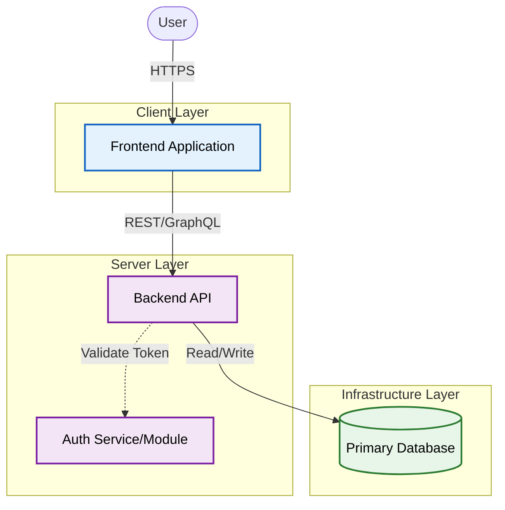
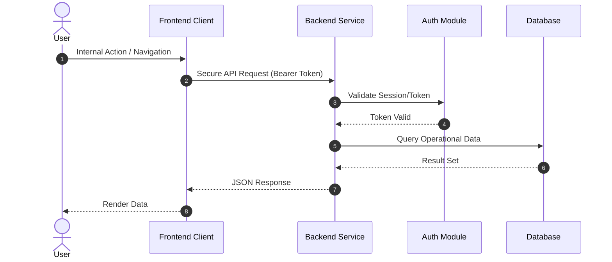
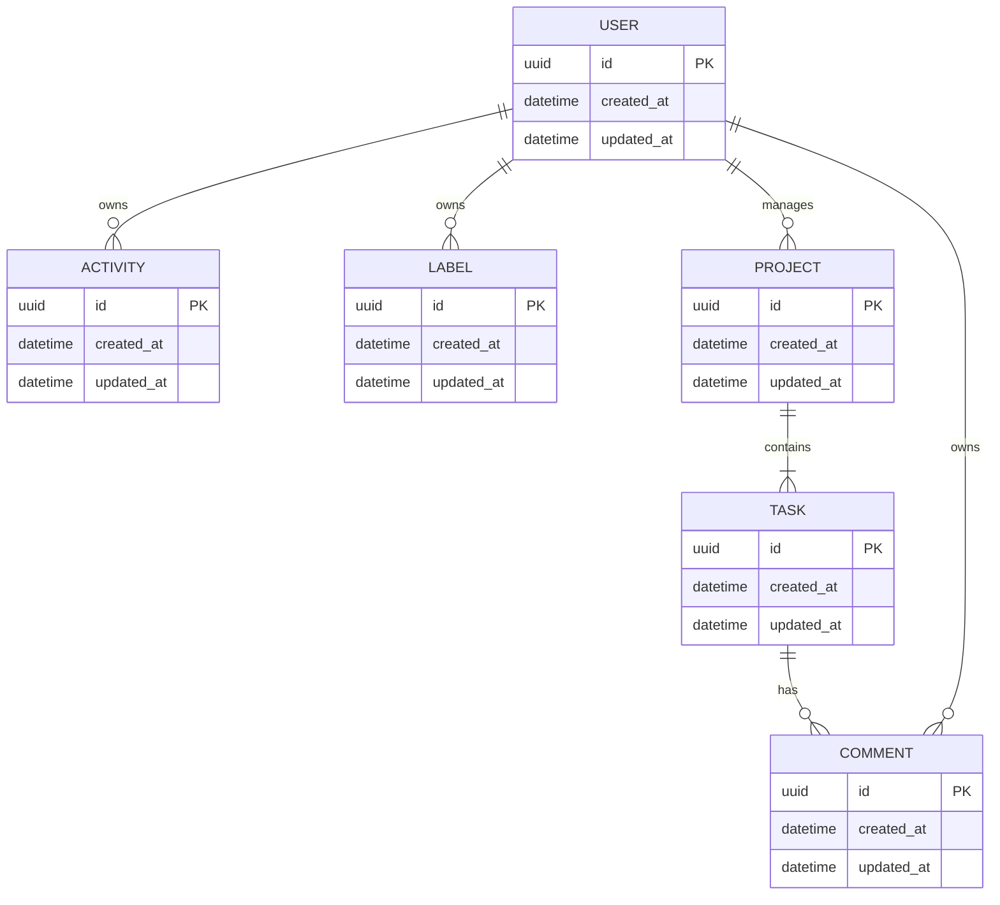

# System Architecture Documentation

**Repository**: `Test-Project-Deployment-Check`
**Branch**: `main`
**Snapshot Commit**: `d4509166`

---

## 1. Executive Overview

This document provides a comprehensive architectural overview of the software system. 
It captures the structural components, interaction flows, and data models inferred from the codebase. 
The architecture is designed to support scalable business operations while maintaining strict separation of concerns.

## 2. System Context

The System Diagram below visualizes the high-level architecture, identifying key components in the Client, Server, and Infrastructure layers.

### System Diagram

**Architectural Highlights:**
- **Client Layer**: Responsible for user interaction and presentation logic.
- **Server Layer**: API Gateway and Service modules managing business logic and security (Auth).
- **Infrastructure Layer**: Persistent storage (Database), Caching (Redis), and Async Messaging (Queues) where applicable.

---

## 3. Interaction Flow

The Sequence Diagram illustrates the typical request lifecycle, demonstrating how data flows from the user, through the API, to the backing services.

### Core Request Flow

**Flow Analysis:**
1. **Secure Access**: Requests are validated via Authentication modules before processing.
2. **Optimization**: Caching mechanisms are employed to reduce database load for read-heavy operations.
3. **Asynchronous Processing**: Long-running tasks are offloaded to background workers to ensure responsive APIs.

---

## 4. Data Model

The Entity-Relationship (ER) diagram represents the domain model and its persistence structure.

### Domain Entities

**Key Data Structures:**
- **Core Entities**: Represents the primary business objects (e.g., User, Project, Resource).
- **Relationships**: Defines the cardinality and dependencies between data models.

---

*This live documentation was automatically generated by the Architecture Analysis Engine.*
